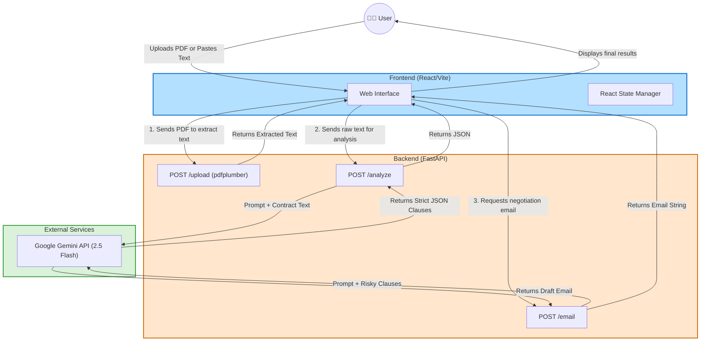

# ClauseGuard: System Architecture

This document outlines the high-level architecture and data flow for the ClauseGuard application, detailing how the user interface, backend logic, and AI services interact.

## 🏗 High-Level Architecture

The system follows a standard modern 3-Tier architecture:
1.  **Presentation Layer (Frontend):** A static Single-Page Application (SPA) built with React and Vite. It is responsible for user interactions and input gathering.
2.  **Application Layer (Backend):** A RESTful API built with Python and FastAPI. It acts as the orchestrator between the frontend and the AI.
3.  **Intelligence Layer (AI API):** Google's Gemini Large Language Model (2.5 Flash), which handles the complex reasoning tasks.

## 🔄 Core Workflows

### 1. Document Ingestion Flow
*   **Action:** The user uploads a PDF file via the File dropzone.
*   **Process:** The frontend sends a multipart-form data request to the `POST /upload` endpoint. The FastAPI backend receives the file entirely in memory (via `io.BytesIO`) and utilizes the `pdfplumber` library to parse through the pages and extract raw text.
*   **Result:** Up to 8000 characters of extracted text are returned to the frontend and populated into the text area.

### 2. Clause Analysis Flow
*   **Action:** The user clicks "Run Analysis".
*   **Process:** The frontend fires a `POST /analyze` request sending the raw text. 
*   **AI Integration:** The backend injects the unformatted document into an aggressively constrained prompt template (`prompts.py`). It forces the Gemini model to utilize the `application/json` output format, ensuring the AI strictly returns an array of evaluated clauses without conversational filler.
*   **Result:** The frontend receives the array of clauses, automatically categorizing them by High, Medium, or Low risk, and displaying the original text, explanation, and rewrite suggestions in an animated UI block.

### 3. Negotiation Email Generation Flow
*   **Action:** The user decides to negotiate the problematic terms.
*   **Process:** The frontend filters the analyzed clauses locally to isolate only the "High" and "Medium" risk items. It then sends this curated list to the `POST /email` endpoint.
*   **AI Integration:** The backend formats these clauses into an email instruction prompt template. Gemini generates a human-like, polite negotiation draft.
*   **Result:** The backend returns the drafted email text to the frontend, which is displayed in an isolated email panel with a simple click-to-copy utility.

## 🔐 Security & Deployment

*   **Stateless Architecture:** The backend maintains zero state or session storage. It doesn't save uploaded PDFs, AI responses, or analytics to a database. This guarantees maximum privacy for the user’s legal documents.
*   **Environment Handling:** Secrets (like the `GEMINI_API_KEY`) are kept strictly out of the repository codebase via standard ENV variables. The frontend dynamically resolves the backend URL during the build phase (`VITE_API_URL`), enabling separate scaling and deployment hosting.
